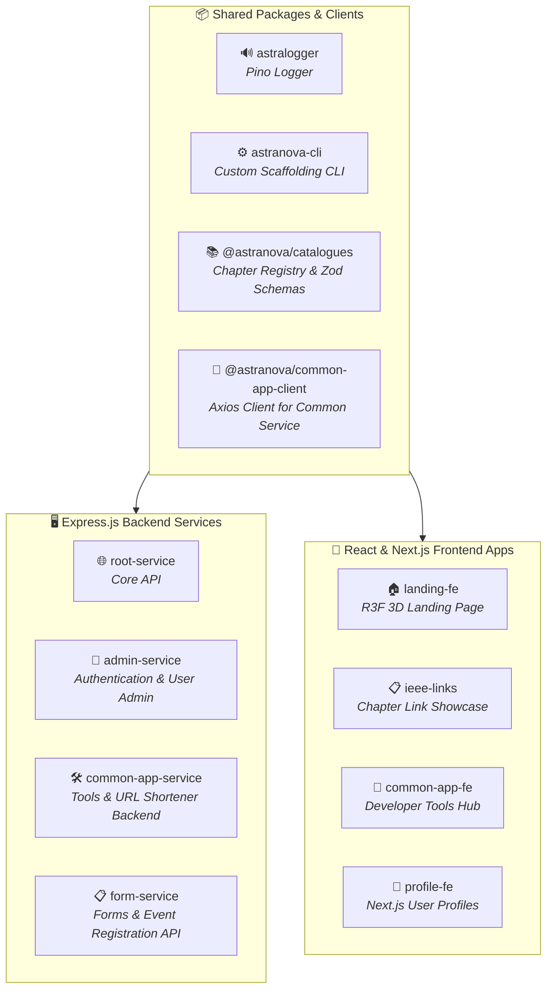

# 🚀 Agent Onboarding & System Guide

Welcome, Agent! This document is the comprehensive onboarding guide and source of truth for the **IEEE RIT-B Suite** repository. It outlines the monorepo architecture, packages, services, specific versions, design patterns, and development workflows you must adhere to when working on this codebase.

---

## 🛠️ Workspace & Build Operations

### 1. Build and Dependency Synchronization
After any major change (adding a dependency, modifying package links, creating a package/service, or updating shared package files), you **must** run:
```bash
pnpm install && pnpm build-all
```
This ensures that the workspace packages are correctly linked and that dependent projects compile without errors.

### 2. Project Execution & Filtering
When running, building, testing, or launching individual projects within the monorepo, always scope the command using `pnpm --filter`.
Examples:
- Run a specific frontend dev server: `pnpm --filter frontend-project dev`
- Run a specific backend dev server: `pnpm --filter backend-project dev`

---

## 🧼 Code Quality & Linting Compliance

### 3. Automatic Linting and Formatting
Always run lint and formatting checks after completing code changes using the workspace's default configurations for **ESLint** and **Prettier**:
- Lint the codebase: `pnpm lint` (or run local ESLint directly on changed files)
- Format files: `pnpm prettier --write <path-to-file>`

Ensure no warnings or errors exist in the modified files.

---

## 🏗️ Architectural & Coding Guidelines

### 4. Code Reuse and Dependency Management
Always leverage the existing packages inside the monorepo (`packages/`) to avoid writing redundant logic. Reuse utilities like `astralogger` for logging instead of introducing standard console logs or new logging implementations.

### 5. Proper Abstraction
Keep your logic modular and clean.
- Separate core business logic from routing/scaffolding code.
- Create utility helpers in packages where appropriate so other services can reuse them.
- Abstract repeating structures into clear functions, classes, or interfaces.

### 6. Readability & Self-Documenting Code
Write clean, simple, and self-documenting code.
- Use explicit, meaningful variable, function, and class names (avoid abbreviations or cryptic names).
- Limit inline comments to non-obvious business logic only; let the structure and naming explain *how* the code works.
- Keep functions small and focused on a single responsibility.

---

## 🏛️ System Architecture Overview

The **IEEE RIT-B Suite** is a unified, highly optimized monorepo that powers the web presence, chapter directory, and developer tools for the IEEE Student Branch at RIT Bangalore. 

### Monorepo Infrastructure
*   **Orchestration:** [Nx](https://nx.dev/) (v21.1.2) is used for run-many command execution, offering intelligent local build caching and dependency graph rendering.
*   **Package Manager:** [pnpm](https://pnpm.io/) (v10.28.2 or v10.12.3) with standard workspaces configuration.
*   **Language:** Strict [TypeScript](https://www.typescriptlang.org/) across all shared packages and microservices.
*   **Workspace Protocol:** Packages reference each other dynamically inside the workspace using `"workspace:*"` or `"workspace:^"`.



---

## 📂 Directory Structure

The repository is organized cleanly into four core sections:

```
ieee-ritb-suite/
├── 📦 packages/                      # Shared libraries and packages
│   ├── 🔊 astralogger/              # Pino-based unified logger
│   ├── ⚙️ astranova-cli/            # Scaffolding tool for microservices
│   └── 📚 catalogues/               # Single-source-of-truth IEEE Chapter registry
├── 🔧 services/
│   ├── 🖥️ backend/                  # TypeScript Express.js backend services
│   │   ├── 🔐 admin-service/        # better-auth authentication gateway
│   │   ├── 🌐 root-service/         # Main public API 
│   │   ├── 🛠️ common-app-service/   # Backend for developer tools and URL shortener
│   │   │   └── 🔌 client/           # Contains @astranova/common-app-client
│   │   └── 📋 form-service/         # Form ingestion and data capture
│   └── 🎨 frontend/                 # Vite & Next.js frontend applications
│       ├── 🏠 landing-fe/           # 3D R3F landing page
│       ├── 🧰 common-app-fe/        # Dev-tools web application
│       ├── 📋 ieee-links/           # Links showcase
│       └── 👤 profile-fe/           # Next.js authentication & dashboard app
└── 📜 scripting/                    # Entry point for monorepo automation scripts
```

> [!NOTE]
> The conceptually separated `url-shortener-service` listed in some higher-level diagrams is physically unified under `services/backend/common-app-service` which manages both the developer tool state and the `ritb.in` URL shortener mappings.

### Cron Job Endpoint — `GET /api/cron`

The `common-app-service` exposes a secured health-check endpoint at `/api/cron` designed to be triggered by [cron-job.org](https://cron-job.org).

**Authentication:**
- The endpoint requires a custom header `x-cron-secret` matching the `CRON_SECRET` environment variable.
- Returns `401` with `"Invalid cron secret"` if the header is missing or mismatched.

**Generate a secret:**
```bash
node -e "console.log(require('crypto').randomBytes(32).toString('hex'))"
```

**cron-job.org setup:**
1. Set `CRON_SECRET=<generated-key>` in the service's `.env` file
2. Create a job targeting `https://<domain>/api/cron`
3. Go to **Advanced > Custom Headers** and add `x-cron-secret: <generated-key>`

**Success response (200):**
```json
{ "success": true, "data": { "timestamp": "...", "message": "Cron job executed successfully" }, "message": "Cron job completed" }
```

**Related files:**
- `src/routes/index.ts` — route definition with header check middleware
- `src/controllers/cron/cronHandler.ts` — controller logic
- `src/validators/index.ts` — `CronRequestValidator` / `CronResponseValidator`
- `src/configs/index.ts` — reads `CRON_SECRET` from env
- `.env.example` — `CRON_SECRET` placeholder

---

## 📦 Shared Packages & Client Registries

### 1. `🔊 astralogger`
*   **Location:** `file:///d:/ieee-ritb-suite/packages/astralogger`
*   **Key Dependencies:** `pino` (`^9.7.0`), `pino-pretty` (`^13.0.0`), `typescript` (`^5.8.3`).
*   **Purpose:** Environment-aware logger utility implementing a cached singleton pattern.
*   **Patterns & Usage:**
    *   Configured using a local `astralogger.json` in the root of the running service.
    *   **Production Safety:** Automatically enforces the `info` log level limit in production environments (`process.env.NODE_ENV !== "development"`) to prevent exposing trace or debug data.
    *   **Import Pattern:**
        ```typescript
        import { getAstraLogger } from "astralogger";
        getAstraLogger().info("Server started successfully!");
        ```

### 2. `📚 @astranova/catalogues`
*   **Location:** `file:///d:/ieee-ritb-suite/packages/catalogues`
*   **Key Dependencies:** `zod` (`^4.1.9`), `typescript` (`^5.8.3`).
*   **Purpose:** Single source of truth (SSOT) data model for all 18 IEEE Chapters in the Bangalore Student Branch (12 Technical, 6 Non-Technical).
*   **Exported Elements:**
    *   `ChapterType`: Enums (`TECH` = `"tech"`, `NON_TECH` = `"non-tech"`).
    *   `IChapter`: Interface specifying name, acronym, type, description, and accent theme color.
    *   `Chapters`: Array of read-only chapter definitions.
    *   `ChapterNames` / `ChapterAcronyms`: Extracted arrays.
    *   `ChapterNameSchema`: Zod validation schema built from catalogued chapters.

### 3. `⚙️ astranova-cli`
*   **Location:** `file:///d:/ieee-ritb-suite/packages/astranova-cli`
*   **Key Dependencies:** `@mrknown404/create-express-app` (`^1.0.15`), `chalk` (`^5.6.2`), `inquirer` (`^12.9.6`), `ora` (`^9.0.0`).
*   **Purpose:** Scaffolds complete frontend/backend applications dynamically inside the monorepo workspace.
*   *   **Backend generation:** Generates TypeScript + Express configurations with preloaded `astralogger.json`, ESLint, Zod validation systems, and launches package installation.
*   *   **Frontend generation:** Scaffolds high-speed React-TS frontends via `create-vite`, injects Tailwind CSS v4, sets up paths aliases (`@/*`), configurations for `vite.config.ts`, template `App.tsx`, and updates workspace rules.

### 4. `🔌 @astranova/common-app-client`
*   **Location:** `file:///d:/ieee-ritb-suite/services/backend/common-app-service/client`
*   **Key Dependencies:** `axios` (`^1.13.5`), `tsc-alias` (`^1.8.16`).
*   **Purpose:** Client SDK exported by the `common-app-service` workspace module, providing strongly typed HTTP abstractions for frontend integration.

---

## 🖥️ Backend Microservices

All backends are developed with strict TypeScript using the **Express.js v5** framework, connected to a MongoDB backend database.

| Backend Service | Directory | Key Packages & Versions | Description & Patterns |
| :--- | :--- | :--- | :--- |
| **🔐 admin-service** | `services/backend/admin-service` | `better-auth` (`^1.3.13`), `mongodb` (`^6.20.0`), `cloudinary` (`^2.9.0`), `zod` (`^4.1.9`) | Serves auth requests and exports compiled clients/types. Houses `/src` with route structures, storage integrations, and better-auth configurations. |
| **🌐 root-service** | `services/backend/root-service` | `express` (`^5.1.0`), `mongodb` (`^6.20.0`), `@astranova/catalogues`, `astralogger` | Main entry backend for public site endpoints, integrating shared packages for structured chapter verification. |
| **🛠️ common-app-service** | `services/backend/common-app-service` | `express` (`^5.1.0`), `mongodb` (`^6.20.0`), `zod` (`^4.1.12`), `astralogger` | Houses API endpoints for internal tools, short URL forwarding, and a secured `GET /api/cron` endpoint triggered by cron-job.org via the `x-cron-secret` header. |
| **📋 form-service** | `services/backend/form-service` | `express` (`^5.1.0`), `mongodb` (`^6.20.0`), `zod` (`^4.1.12`) | Dynamic backend designed for robust event registration data intake and validations. |

### Backend Service Code Layout
All backend packages adopt this strict modular architecture inside `src/`:
```
src/
├── configs/            # Port numbers and system configurations (hardcoded default 3000 mapped dynamically)
├── controllers/        # Express route handler logic
├── db/                 # DB connection and collection initializers
├── lib/                # Shared internal helper libraries (e.g. better-auth settings)
├── middlewares/        # Custom Express request filters (auth guards, logging hooks)
├── routes/             # Route mapping definitions
├── schemas/            # Zod validation schemas
├── types/              # TS interface files
├── utils/              # Utility helper functions
├── index.ts            # Entry listener (imports env settings first, then boots express app)
└── app.ts              # Express application assembly (CORS, body-parser, and routing configuration)
```

---

## 🎨 Frontend Applications

Frontend clients utilize modern React v19 structures styled using Tailwind CSS v4.

### 1. `🏠 landing-fe`
*   **Location:** `file:///d:/ieee-ritb-suite/services/frontend/landing-fe`
*   **Core UI Tech Stack:** `react` (`^19.1.1`), `three` (`^0.180.0`), `@react-three/fiber` (`^9.4.0`), `framer-motion` (`^12.23.23`), `lenis` (`^1.3.17`), `@tailwindcss/vite` (`^4.1.14`).
*   **Purpose:** 3D WebGL landing page featuring premium animations, Lenis smooth scrolling, and dynamic React Three Fiber canvases. Imports custom type-faces: `@fontsource/inter`, `@fontsource/jetbrains-mono`, `@fontsource/space-grotesk`.

### 2. `🧰 common-app-fe`
*   **Location:** `file:///d:/ieee-ritb-suite/services/frontend/common-app-fe`
*   **Core UI Tech Stack:** `react` (`^19.1.1`), `react-router` (`^7.9.4`), Radix UI Primitives (Dropdowns, Dialogs, Select), `lucide-react` (`^0.511.0`), `sonner` (`^2.0.7`), `class-variance-authority` (`^0.7.1`).
*   **Purpose:** Developer tools application integrating client-side helpers (UUID generators, JSON parsers) and `@astranova/common-app-client` to access backend APIs.

### 3. `📋 ieee-links`
*   **Location:** `file:///d:/ieee-ritb-suite/services/frontend/ieee-links`
*   **Core UI Tech Stack:** `react` (`^19.1.1`), `framer-motion` (`^12.23.22`), `@tailwindcss/vite` (`^4.1.14`).
*   **Purpose:** Linktree-styled portal linking out to chapter showcase events, using Framer Motion animations.

### 4. `🏭 industry-conclave-fe` (Under Development)
*   **Location:** `file:///d:/ieee-ritb-suite/services/frontend/industry-conclave-fe`
*   **Core UI Tech Stack:** React, Tailwind v4, Radix UI Primitives.
*   **Purpose:** Interactive landing portal specifically optimized for managing industry event conclaves.

### 5. `👤 profile-fe`
*   **Location:** `file:///d:/ieee-ritb-suite/services/frontend/profile-fe`
*   **Core UI Tech Stack:** `next` (`16.2.4`), `react` (`19.2.4`), `better-auth` (`^1.3.13`), `@tailwindcss/postcss` (`^4`), `zod` (`^4.3.6`), `nodemailer` (`^6.10.0`).
*   **Purpose:** High-performance, Server-Side Rendered dashboard built on Next.js, allowing students to access profiles, register for conclaves, and manage login sessions.

---

## 🛠️ Developer Scaffolding & CLI Workflows

Instead of copying and pasting service configurations manually, you **MUST** leverage the scripting tools configured via `astranova-cli`:

### Scaffolding Commands
All command processes must be triggered from the monorepo root:

```bash
# To scaffold a new, complete Express backend microservice:
pnpm rs create-be <service-name>

# To scaffold a new, complete Vite + React + TypeScript + Tailwind v4 frontend application:
pnpm rs create-fe <application-name>
```

### Script Execution Logic
1.  Root `package.json` maps `"rs"` to `"pnpm --filter scripting run"`.
2.  The `scripting` module calls out to `astranova-cli` inside the workspace.
3.  The CLI utilizes custom plugins to bootstrap templates with path alias systems (`@/*`), strict types, logging defaults (`astralogger.json`), and automatically launches `pnpm install` in the monorepo root to link packages.

---

## 📐 Coding Standards & Workspace Patterns

### 1. Workspace Dependency Links
Never publish shared packages or link them manually. Use pnpm workspace protocol patterns:
```json
"dependencies": {
  "@astranova/catalogues": "workspace:*",
  "astralogger": "workspace:*"
}
```

### 2. Path Aliases
Always configure path aliasing inside local configs to keep imports readable and prevent directory traversal (`../../../`):
*   **TypeScript (`tsconfig.json`):**
    ```json
    "paths": {
      "@/*": ["./src/*"]
    }
  ```
*   **Vite Configuration (`vite.config.ts`):**
    ```typescript
    resolve: {
      alias: {
        "@": path.resolve(__dirname, "./src"),
      },
    }
    ```
*   **Import Pattern:**
    ```typescript
    import { db } from "@/db"; // DO THIS
    import { db } from "../../../db"; // AVOID THIS
    ```

### 3. Application Styling stack
*   **Tailwind CSS v4:** Frontend clients utilize Tailwind CSS v4 (using `@tailwindcss/vite` in Vite or `@tailwindcss/postcss` in Next.js). Use `@import "tailwindcss";` inside `src/index.css`.
*   **Component Assembly:** Compose responsive layouts using primitive Headless APIs (Radix UI) styled with Tailwind classes.
*   **Class Merging:** Always use `clsx` and `tailwind-merge` to resolve styling classes on dynamic custom elements:
    ```typescript
    import { clsx, type ClassValue } from "clsx";
    import { twMerge } from "tailwind-merge";
    
    export function cn(...inputs: ClassValue[]) {
        return twMerge(clsx(inputs));
    }
    ```

### 4. Logger Usage Pattern
*   Never use `console.log` or `console.error` directly inside backend routes or controllers.
*   Always use `getAstraLogger()` instance to output logs cleanly into JSON streams parsed by pino/pino-pretty.
    ```typescript
    import { getAstraLogger } from "astralogger";
    const logger = getAstraLogger();
    
    try {
        // ... action logic
    } catch (error) {
        logger.error({ err: error }, "Failed to fetch event catalogues");
    }
    ```

### 5. Input Validation
*   Every endpoint handling request parameters, query tokens, or payload bodies **MUST** validate inputs using [Zod](https://zod.dev/) schemas before passing data to databases or controller logic.
*   Zod validation schemas should be placed under `src/schemas/` directory in backends.

---

## ⚡ Nx Operations & Local Caching

All packages and microservices utilize standardized build pipelines under Nx. To build the entire project suite utilizing intelligent caching run:

```bash
pnpm build-all
```

To see the interactive module dependencies mapping, run:
```bash
pnpm nx graph
```

> [!TIP]
> **Maximize Build Speeds:** Maintain absolute purity of build task targets configured in package configuration files. Nx automatically maintains artifacts in `.nx/cache` to speed up subsequent builds locally and on CI/CD nodes.

---

## 📚 Official Documentation Links

For details on the specifications, APIs, and guidelines of key frameworks and libraries used in this suite, refer to their official documentation:

### Core Frameworks & Build Tools
*   **pnpm Workspaces:** [pnpm.io Workspaces](https://pnpm.io/workspaces) — Monorepo dependency resolution and sharing.
*   **Nx Build System:** [nx.dev Documentation](https://nx.dev) — Workspace orchestration and local caching pipeline.
*   **Vite 7:** [vite.dev Guide](https://vite.dev) — Lightning-fast HMR and building for frontends.
*   **Next.js 16:** [nextjs.org/docs](https://nextjs.org/docs) — SSR, API routing, and dashboard optimization.
*   **TypeScript:** [typescriptlang.org/docs](https://www.typescriptlang.org/) — Strict static typing protocols.

### Backend & Security
*   **better-auth:** [better-auth.com Guide](https://www.better-auth.com) — Session handlers, OAuth providers, and auth clients.
*   **Express.js v5:** [expressjs.com Reference](https://expressjs.com) — Modern async middleware routing.
*   **MongoDB Node.js Driver:** [mongodb.com Docs](https://www.mongodb.com/docs/) — Document queries and data operations.
*   **Zod Schema Validation:** [zod.dev Documentation](https://zod.dev) — Strict structural validation rules.
*   **Cloudinary Node SDK:** [cloudinary.com Guide](https://cloudinary.com/documentation) — Cloud image upload, optimization, and media management.
*   **Pino Logger:** [getpino.io Guide](https://getpino.io) — Ultra low overhead JSON streaming logs.

### Frontend UI, Styling & Visuals
*   **Tailwind CSS v4:** [tailwindcss.com v4 Guide](https://tailwindcss.com/docs/v4-beta) — Next-gen styling, fast compile times, and design primitives.
*   **shadcn ui:** [ui.shadcn.com Guide](https://ui.shadcn.com) — Reusable accessible component blocks configured via `components.json`.
*   **Radix UI Primitives:** [radix-ui.com Primitives](https://www.radix-ui.com/primitives) — Accessible unstyled primitive primitives (Dropdowns, Dialogs, Selects).
*   **Three.js:** [threejs.org Docs](https://threejs.org/docs/) — Core WebGL engine.
*   **React Three Fiber (R3F):** [docs.pmnd.rs/react-three-fiber](https://docs.pmnd.rs/react-three-fiber) — Declarative Three.js wrapper inside React elements.
*   **Framer Motion:** [framer.com/motion](https://www.framer.com/motion/) — Advanced page transitions and hover interactions.
*   **Lenis Smooth Scroll:** [lenis.darkroom.engineering](https://lenis.darkroom.engineering/) — High-performance smooth scrolling engine.

---

*This document serves as the developer handbook for the project. If there are changes to workspace dependencies or architectural patterns, update this file immediately.*
