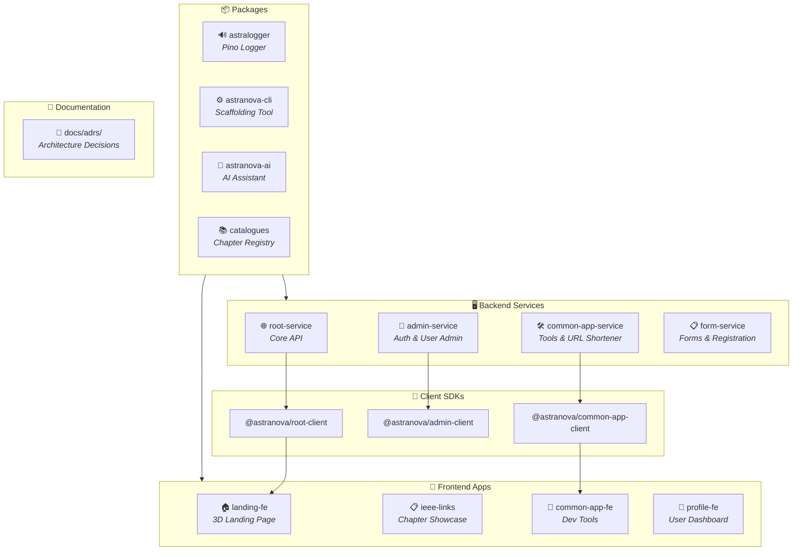

<div align="center">

<!-- Badges Row 1: Tech Stack -->
[![React][react-shield]][react-url]
[![Vite][vite-shield]][vite-url]
[![TypeScript][typescript-shield]][typescript-url]
[![Tailwind][tailwind-shield]][tailwind-url]
[![Three.js][threejs-shield]][threejs-url]

[![MongoDB][mongodb-shield]][mongodb-url]
[![pnpm][pnpm-shield]][pnpm-url]
[![Nx][nx-shield]][nx-url]

<br/>

</div>

## 📋 Table of Contents

- [🚀 Quick Start](#-quick-start)
- [🏛️ Architecture](#️-architecture)
- [✨ Features](#-features)
- [📖 Architecture Decision Records](#-architecture-decision-records)
- [⚡ Tech Stack](#-tech-stack)
- [🛠️ Commands](#️-commands)
- [📦 Packages & Services](#-packages--services)
- [📊 Project Statistics](#-project-statistics)
- [🤝 Contributing](#-contributing)
- [📞 Contact](#-contact)

<br/>

## 🤖 Agentic Development Setup

> **IMPORTANT:** Developers are strongly encouraged to use these commands to spin up their own local agentic development environment for this project. This is the recommended approach for any sort of agentic development work within the monorepo.

| Command | Description |
|---------|-------------|
| `pnpm ai` | Starts/detects the server and opens the browser to the latest session |
| `pnpm ai --fresh` | Starts a fresh browser session |
| `pnpm ai "your prompt"` | Runs prompt asynchronously in the Web UI, continuing the last session |
| `pnpm ai --tui "your prompt"` | Runs prompt in the Terminal UI |
| `pnpm ai --native "your prompt"` | Runs prompt synchronously in the terminal |
| `pnpm ai --help` | Shows all available flags and options |

<br/>

## 🚀 Quick Start

<table>
<tr>
<td width="60">

**①**

</td>
<td>

**Prerequisites**

</td>
</tr>
</table>

```bash
# Ensure you have Node.js and pnpm installed
node --version    # v18+ recommended
pnpm --version    # v10.12.3
```

<table>
<tr>
<td width="60">

**②**

</td>
<td>

**Clone & Install**

</td>
</tr>
</table>

```bash
git clone https://github.com/IEEE-Ritb-Website/ieee-ritb-suite.git
cd ieee-ritb-suite
pnpm install
```

<table>
<tr>
<td width="60">

**③**

</td>
<td>

**Build Everything**

</td>
</tr>
</table>

```bash
pnpm build-all    # Nx-powered build with intelligent caching
```

<table>
<tr>
<td width="60">

**④**

</td>
<td>

**Configure Environment**

</td>
</tr>
</table>

```bash
cp .env.example .env
# Edit .env with your MongoDB URL and auth credentials
```

<table>
<tr>
<td width="60">

**⑤**

</td>
<td>

**Start Developing**

</td>
</tr>
</table>

```bash
# Backend service
cd services/backend/<service-name>
pnpm start

# Frontend app (with HMR)
cd services/frontend/<app-name>
pnpm dev
```

<p align="right">(<a href="#-table-of-contents">back to top</a>)</p>

<br/>

## 🏛️ Architecture

### System Overview


```mermaid
graph TB
    subgraph Packages["📦 Packages"]
        AL["🔊 astralogger<br/><i>Pino Logger</i>"]
        CLI["⚙️ astranova-cli<br/><i>Scaffolding Tool</i>"]
        AI["🤖 astranova-ai<br/><i>AI Assistant</i>"]
        CAT["📚 catalogues<br/><i>Chapter Registry</i>"]
    end

    subgraph Backend["🖥️ Backend Services"]
        ROOT["🌐 root-service<br/><i>Core API</i>"]
        ADMIN["🔐 admin-service<br/><i>Auth & User Admin</i>"]
        COMMON["🛠️ common-app-service<br/><i>Tools & URL Shortener</i>"]
        FORM["📋 form-service<br/><i>Forms & Registration</i>"]
    end

    subgraph Clients["🔌 Client SDKs"]
        RC["@astranova/root-client"]
        AC["@astranova/admin-client"]
        CC["@astranova/common-app-client"]
    end

    subgraph Frontend["🎨 Frontend Apps"]
        LAND["🏠 landing-fe<br/><i>3D Landing Page</i>"]
        LINKS["📋 ieee-links<br/><i>Chapter Showcase</i>"]
        TOOLS["🧰 common-app-fe<br/><i>Dev Tools</i>"]
        PROFILE["👤 profile-fe<br/><i>User Dashboard</i>"]
    end

    subgraph Docs["📖 Documentation"]
        ADR["📝 docs/adrs/<br/><i>Architecture Decisions</i>"]
    end

    Packages --> Backend
    Packages --> Frontend

    ROOT --> RC
    ADMIN --> AC
    COMMON --> CC

    RC --> LAND
    CC --> TOOLS
```

### Directory Structure

```
ieee-ritb-suite/
│
├── 📦 packages/                      # Shared libraries
│   ├── 🔊 astralogger/              # Pino-based logging utility
│   ├── ⚙️ astranova-cli/            # Custom scaffolding CLI
│   ├── 🤖 astranova-ai/             # Just runs OpenCode
│   ├── 📦 astranova-core/           # Core environment and monorepo root helpers
│   └── 📚 catalogues/               # IEEE chapter data registry (18 chapters)
│
├── 🔌 shared-clients/           # Centralized API client singletons (with client-config.json)
│
├── 🔧 services/
│   │
│   ├── 🖥️ backend/                  # Express.js microservices
│   │   ├── 🔐 admin-service/        # Auth & user administration
│   │   ├── 🌐 root-service/         # Core public API
│   │   ├── 🛠️ common-app-service/   # Dev tools backend & URL shortener
│   │   └── 📋 form-service/         # Forms & event registration
│   │
│   └── 🎨 frontend/                 # Vite + React frontends
│       ├── 🏠 landing-fe/           # 3D landing page
│       ├── 🧰 common-app-fe/        # Developer tools dashboard
│       ├── 📋 ieee-links/           # Chapter link showcase
│       └── 👤 profile-fe/           # Next.js user dashboard
│
├── 📖 docs/
│   └── 📝 adrs/                     # Architecture Decision Records
│
└── 📜 scripting/                    # CLI entry point
```

<p align="right">(<a href="#-table-of-contents">back to top</a>)</p>

<br/>

## ✨ Features

<table>
<tr>
<td align="center" width="150">

### 🛠️
**Custom CLI**

</td>
<td>

Scaffold new services instantly with `pnpm rs create-be/fe` - generates TypeScript, ESLint, Zod, and all configs automatically

</td>
</tr>
<tr>
<td align="center">

### 🔗
**Workspace Linking**

</td>
<td>

Shared packages auto-link via `workspace:*` protocol - no manual linking or publishing required

</td>
</tr>
<tr>
<td align="center">

### ⚡
**Nx Build Caching**

</td>
<td>

Intelligent builds that only rebuild what changed - dramatically faster CI/CD pipelines

</td>
</tr>
<tr>
<td align="center">

### 🔊
**Unified Logging**

</td>
<td>

Shared Pino-based logger across all services via `astralogger` package with environment-aware levels

</td>
</tr>
<tr>
<td align="center">

### 📚
**Chapter Registry**

</td>
<td>

Single source of truth for 18 IEEE chapters with Zod-validated schemas

</td>
</tr>
<tr>
<td align="center">

### 🌐
**3D Landing Page**

</td>
<td>

Stunning Three.js + React Three Fiber powered landing with WebGL effects

</td>
</tr>
</table>

<p align="right">(<a href="#-table-of-contents">back to top</a>)</p>

<br/>

## 📖 Architecture Decision Records

Architecture Decision Records (ADRs) are lightweight documents that capture important architectural decisions made during the project's development. Each ADR records a specific decision, its context, the options considered, and the rationale for the chosen approach.

**Purpose:** ADRs provide a historical record of why the project is built the way it is — helping current and future contributors understand the reasoning behind key choices without needing to rediscover or debate them again.

**Location:** [`docs/adrs/`](docs/adrs/)

| ADR | Title | Decision |
|-----|-------|----------|
| [ADR-001](docs/adrs/0001-pnpm-package-manager.md) | pnpm as Package Manager | Why pnpm was chosen over npm and Yarn |
| [ADR-002](docs/adrs/0002-nx-build-system.md) | Nx Build System | Why Nx was chosen for monorepo orchestration |
| [ADR-003](docs/adrs/0003-monorepo-architecture.md) | Monorepo Architecture | Why a monorepo structure was adopted |
| [ADR-004](docs/adrs/0004-react-hook-form-with-zod.md) | React Hook Form with Zod | Why react-hook-form and Zod are used for form validation |
| [ADR-005](docs/adrs/0005-cron-jobs.md) | Cron Jobs for Backend Services | Why cron jobs are used (Render free tier constraints) |
| [ADR-006](docs/adrs/0006-ci-cd-deployment.md) | CI/CD and Deployment Strategy | Deployment targets and pipeline choices |
| [ADR-007](docs/adrs/0007-client-sdk-pattern.md) | Client SDK Pattern | Typed API client packages co-located with backend services |
| [ADR-008](docs/adrs/0008-centralized-clients-and-core-split.md) | Centralized Clients & Core Split | Instantiated client singletons in shared-clients and astranova-core entrypoints |

<p align="right">(<a href="#-table-of-contents">back to top</a>)</p>

<br/>

## ⚡ Tech Stack

<table>
<tr>
<th align="left" width="140">Category</th>
<th align="left">Technologies</th>
</tr>
<tr>
<td><b>🏗️ Build System</b></td>
<td>

![pnpm][pnpm-badge] ![Nx][nx-badge] ![TypeScript][ts-badge]

</td>
</tr>
<tr>
<td><b>🖥️ Backend</b></td>
<td>

![Node.js][node-badge] ![Express][express-badge] ![MongoDB][mongo-badge] ![Zod][zod-badge]

</td>
</tr>
<tr>
<td><b>🎨 Frontend</b></td>
<td>

![React][react-badge] ![Vite][vite-badge] ![Tailwind][tw-badge] ![Radix][radix-badge]

</td>
</tr>
<tr>
<td><b>🎬 3D/Animation</b></td>
<td>

![Three.js][three-badge] ![R3F][r3f-badge] ![Framer][framer-badge]

</td>
</tr>
</table>

<p align="right">(<a href="#-table-of-contents">back to top</a>)</p>

<br/>

## 🛠️ Commands

### 📥 Setup & Installation

| Command | Description |
|---------|-------------|
| `pnpm install` | Install all workspace dependencies |
| `pnpm build-all` | Build all packages and services with Nx caching |

### 🆕 Scaffolding New Services

| Command | Description |
|---------|-------------|
| `pnpm rs create-be <name>` | Create new Express backend in `services/backend/` |
| `pnpm rs create-fe <name>` | Create new Vite+React frontend in `services/frontend/` |

### 🤖 AI Command Assistant (astranova-ai)

The suite includes a project-local AI developer assistant wrapper (`astranova-ai`, aliased as `ai`) that calls OpenCode. It runs prompts in the Web UI (`--web`, default), Terminal UI (`--tui`), or headlessly in the terminal (`--native`).

| Command | Description |
|---------|-------------|
| `pnpm ai` | Starts/detects the server and opens the browser to the latest session |
| `pnpm ai --fresh` | Starts a fresh browser session |
| `pnpm ai "your prompt"` | Runs prompt asynchronously in the Web UI, continuing the last session |
| `pnpm ai --fresh "your prompt"` | Runs prompt asynchronously in the Web UI in a fresh session |
| `pnpm ai --tui "your prompt"` | Runs prompt in the Terminal UI, continuing the last session |
| `pnpm ai --tui --fresh "your prompt"` | Runs prompt in the Terminal UI in a fresh session |
| `pnpm ai --native "your prompt"` | Runs prompt synchronously directly in the terminal, continuing the last session |
| `pnpm ai --native --fresh "your prompt"` | Runs prompt synchronously in the terminal as a fresh session |

### 🖥️ Backend Development

```bash
cd services/backend/<service-name>
```

| Command | Description |
|---------|-------------|
| `pnpm start` | Run compiled code (`node dist/index.js`) |
| `pnpm run build` | TypeScript compile (`tsc && tsc-alias`) |
| `pnpm run lint` | Run ESLint |

### 🎨 Frontend Development

```bash
cd services/frontend/<app-name>
```

| Command | Description |
|---------|-------------|
| `pnpm dev` | Vite dev server with HMR |
| `pnpm run build` | TypeScript + Vite production build |
| `pnpm run preview` | Preview production build |
| `pnpm run lint` | Run ESLint |

### 📊 Nx Operations

| Command | Description |
|---------|-------------|
| `nx run-many --target=build --all` | Build all projects with caching |
| `nx graph` | Visualize dependency graph |

<p align="right">(<a href="#-table-of-contents">back to top</a>)</p>

<br/>

## 📦 Packages & Services

### Shared Packages

| Package | Description | Key Features |
|---------|-------------|--------------|
| **🔊 astralogger** | Pino-based logging utility | Singleton pattern, env-aware levels, `astralogger.json` config |
| **⚙️ astranova-cli** | Custom scaffolding tool | Generates Express/Vite apps with TypeScript, ESLint, Zod |
| **🤖 astranova-ai** | Local AI developer assistant CLI wrapper | Terminal or Web UI execution modes, dynamic project-local binary resolution |
| **📦 astranova-core** | Core environment and path helpers | Separate browser-safe and Node-only entrypoints, CommonJS compatible |
| **📚 @astranova/catalogues** | IEEE chapter data registry | Zod-validated schemas, 18 chapters (12 tech, 6 non-tech) |
| **🔌 shared-clients** | Centralized instantiated clients | Singleton API client exports, client-config.json urls, local health checks |

### Frontend Applications

| App | Description | Key Technologies |
|-----|-------------|------------------|
| **🏠 landing-fe** | 3D landing page | Three.js, React Three Fiber, Lenis |
| **🧰 common-app-fe** | Developer tools dashboard | Radix UI, React Router, UUID/JSON/Hash generators |
| **📋 ieee-links** | Chapter link showcase | Framer Motion |
| **👤 profile-fe** | User dashboard & auth | Next.js 16, better-auth |

### Backend Services

| Service | Description | Key Features |
|---------|-------------|--------------|
| **🔐 admin-service** | Auth & user admin | better-auth, Cloudinary, exports auth-client |
| **🌐 root-service** | Core public API | Express v5, MongoDB, chapter catalogues |
| **🛠️ common-app-service** | Dev tools backend & URL shortener | REST APIs, ritb.in short URLs, cron endpoint |
| **📋 form-service** | Forms & event registration | Zod validation, MongoDB |

<p align="right">(<a href="#-table-of-contents">back to top</a>)</p>

<br/>

## 📊 Project Statistics

<div align="center">

| Metric | Count |
|:------:|:-----:|
| 📦 **Shared Packages** | 5 |
| 🖥️ **Backend Services** | 4 |
| 🎨 **Frontend Apps** | 4 |
| 📖 **ADR Documents** | 8 |

</div>

## 🤝 Contributing

We welcome contributions! Here's how to get started:

### 🔧 Setup

```
① Fork this repository
② Clone your fork: git clone <your-fork-url>
③ Create branch: git checkout -b feature-name
④ Install: pnpm install (from root)
⑤ Build: pnpm build-all
```

### 💻 Development Guidelines

| Guideline | Description |
|-----------|-------------|
| **Custom CLI** | Use `pnpm rs create-be/fe <name>` to scaffold new services |
| **Patterns** | Follow existing patterns in `services/backend/` or `services/frontend/` |
| **Architecture** | Review [`docs/adrs/`](docs/adrs/) before making architectural decisions |
| **Shared Packages** | Utilize `astralogger` and `catalogues` |
| **Path Aliases** | Use `@/` prefix for imports: `import { x } from "@/utils/x"` |
| **TypeScript** | Maintain strict mode compliance |

### 📤 Submitting

```
① Test your changes thoroughly
② Lint: pnpm run lint (in service directory)
③ Build: Verify pnpm run build succeeds
④ Commit: Follow conventional commits
⑤ Push: git push origin feature-name
⑥ PR: Create pull request against main branch
⑦ Checks: Ensure all CI checks pass
```

<p align="right">(<a href="#-table-of-contents">back to top</a>)</p>

<br/>

## 📞 Contact

<div align="center">

**Maintained by [Shivesh](https://github.com/TheShiveshNetwork) & [Ahad](https://github.com/ahadullabaig)**

For issues and feature requests, please [open an issue](https://github.com/IEEE-Ritb-Website/ieee-ritb-suite/issues)

</div>

<br/>

<div align="center">

**Built with ❤️ by IEEE RIT Bangalore**

[](https://star-history.com/#IEEE-Ritb-Website/ieee-ritb-suite&Date)

</div>


<!-- BADGE LINKS: Repository Stats -->
[contributors-shield]: https://img.shields.io/github/contributors/IEEE-Ritb-Website/ieee-ritb-suite?style=for-the-badge&color=4d7fff
[contributors-url]: https://github.com/IEEE-Ritb-Website/ieee-ritb-suite/graphs/contributors
[forks-shield]: https://img.shields.io/github/forks/IEEE-Ritb-Website/ieee-ritb-suite?style=for-the-badge&color=4d7fff
[forks-url]: https://github.com/IEEE-Ritb-Website/ieee-ritb-suite/network/members
[stars-shield]: https://img.shields.io/github/stars/IEEE-Ritb-Website/ieee-ritb-suite?style=for-the-badge&color=4d7fff
[stars-url]: https://github.com/IEEE-Ritb-Website/ieee-ritb-suite/stargazers
[issues-shield]: https://img.shields.io/github/issues/IEEE-Ritb-Website/ieee-ritb-suite?style=for-the-badge&color=4d7fff
[issues-url]: https://github.com/IEEE-Ritb-Website/ieee-ritb-suite/issues
[license-shield]: https://img.shields.io/github/license/IEEE-Ritb-Website/ieee-ritb-suite?style=for-the-badge&color=4d7fff
[license-url]: https://github.com/IEEE-Ritb-Website/ieee-ritb-suite/blob/main/LICENSE

<!-- BADGE LINKS: Tech Stack (Header) -->
[react-shield]: https://img.shields.io/badge/React-19-61DAFB?style=for-the-badge&logo=react&logoColor=white
[react-url]: https://react.dev/
[vite-shield]: https://img.shields.io/badge/Vite-7-646CFF?style=for-the-badge&logo=vite&logoColor=white
[vite-url]: https://vite.dev/
[typescript-shield]: https://img.shields.io/badge/TypeScript-5-3178C6?style=for-the-badge&logo=typescript&logoColor=white
[typescript-url]: https://www.typescriptlang.org/
[tailwind-shield]: https://img.shields.io/badge/Tailwind-4-06B6D4?style=for-the-badge&logo=tailwindcss&logoColor=white
[tailwind-url]: https://tailwindcss.com/
[threejs-shield]: https://img.shields.io/badge/Three.js-r170-000000?style=for-the-badge&logo=threedotjs&logoColor=white
[threejs-url]: https://threejs.org/
[nodejs-shield]: https://img.shields.io/badge/Node.js-22-339933?style=for-the-badge&logo=nodedotjs&logoColor=white
[nodejs-url]: https://nodejs.org/
[express-shield]: https://img.shields.io/badge/Express-5-000000?style=for-the-badge&logo=express&logoColor=white
[express-url]: https://expressjs.com/
[mongodb-shield]: https://img.shields.io/badge/MongoDB-6-47A248?style=for-the-badge&logo=mongodb&logoColor=white
[mongodb-url]: https://www.mongodb.com/
[pnpm-shield]: https://img.shields.io/badge/pnpm-10-F69220?style=for-the-badge&logo=pnpm&logoColor=white
[pnpm-url]: https://pnpm.io/
[nx-shield]: https://img.shields.io/badge/Nx-21-143055?style=for-the-badge&logo=nx&logoColor=white
[nx-url]: https://nx.dev/

<!-- BADGE LINKS: Tech Stack Table -->
[pnpm-badge]: https://img.shields.io/badge/pnpm-F69220?style=flat-square&logo=pnpm&logoColor=white
[nx-badge]: https://img.shields.io/badge/Nx-143055?style=flat-square&logo=nx&logoColor=white
[ts-badge]: https://img.shields.io/badge/TypeScript-3178C6?style=flat-square&logo=typescript&logoColor=white
[node-badge]: https://img.shields.io/badge/Node.js-339933?style=flat-square&logo=nodedotjs&logoColor=white
[express-badge]: https://img.shields.io/badge/Express-000000?style=flat-square&logo=express&logoColor=white
[mongo-badge]: https://img.shields.io/badge/MongoDB-47A248?style=flat-square&logo=mongodb&logoColor=white
[zod-badge]: https://img.shields.io/badge/Zod-3E67B1?style=flat-square&logo=zod&logoColor=white
[react-badge]: https://img.shields.io/badge/React_19-61DAFB?style=flat-square&logo=react&logoColor=black
[vite-badge]: https://img.shields.io/badge/Vite_7-646CFF?style=flat-square&logo=vite&logoColor=white
[tw-badge]: https://img.shields.io/badge/Tailwind_v4-06B6D4?style=flat-square&logo=tailwindcss&logoColor=white
[radix-badge]: https://img.shields.io/badge/Radix_UI-161618?style=flat-square&logo=radixui&logoColor=white
[three-badge]: https://img.shields.io/badge/Three.js-000000?style=flat-square&logo=threedotjs&logoColor=white
[r3f-badge]: https://img.shields.io/badge/R3F-000000?style=flat-square&logo=threedotjs&logoColor=white
[framer-badge]: https://img.shields.io/badge/Framer_Motion-0055FF?style=flat-square&logo=framer&logoColor=white
