<div align="center">

<!-- Badges Row 1: Tech Stack -->
[![React][react-shield]][react-url]
[![Vite][vite-shield]][vite-url]
[![TypeScript][typescript-shield]][typescript-url]
[![Tailwind][tailwind-shield]][tailwind-url]
[![Three.js][threejs-shield]][threejs-url]

[![MongoDB][mongodb-shield]][mongodb-url]
[![pnpm][pnpm-shield]][pnpm-url]
[![Nx][nx-shield]][nx-url]

<br/>

**🎯 18 IEEE Chapters** &nbsp;•&nbsp; **🏗️ Nx-Orchestrated** &nbsp;•&nbsp; **⚡ TypeScript-First** &nbsp;•&nbsp; **🎨 React 19 + Tailwind v4**

<br/>

<p align="center">
  <a href="#-quick-start">Quick Start</a> •
  <a href="#-architecture">Architecture</a> •
  <a href="#-tech-stack">Tech Stack</a> •
  <a href="#-features">Features</a> •
  <a href="#-contributing">Contributing</a>
</p>

</div>

---

## 📋 Table of Contents

- [🚀 Quick Start](#-quick-start)
- [🏛️ Architecture](#️-architecture)
- [✨ Features](#-features)
- [⚡ Tech Stack](#-tech-stack)
- [🛠️ Commands](#️-commands)
- [📦 Packages & Services](#-packages--services)
- [📊 Project Statistics](#-project-statistics)
- [🤝 Contributing](#-contributing)
- [📞 Contact](#-contact)

---

## 🚀 Quick Start

<table>
<tr>
<td width="60">

**①**

</td>
<td>

**Prerequisites**

</td>
</tr>
</table>

```bash
# Ensure you have Node.js and pnpm installed
node --version    # v18+ recommended
pnpm --version    # v10.12.3
```

<table>
<tr>
<td width="60">

**②**

</td>
<td>

**Clone & Install**

</td>
</tr>
</table>

```bash
git clone https://github.com/IEEE-Ritb-Website/ieee-ritb-suite.git
cd ieee-ritb-suite
pnpm install
```

<table>
<tr>
<td width="60">

**③**

</td>
<td>

**Build Everything**

</td>
</tr>
</table>

```bash
pnpm build-all    # Nx-powered build with intelligent caching
```

<table>
<tr>
<td width="60">

**④**

</td>
<td>

**Configure Environment**

</td>
</tr>
</table>

```bash
cp .env.example .env
# Edit .env with your MongoDB URL and auth credentials
```

<table>
<tr>
<td width="60">

**⑤**

</td>
<td>

**Start Developing**

</td>
</tr>
</table>

```bash
# Backend service
cd services/backend/<service-name>
pnpm start

# Frontend app (with HMR)
cd services/frontend/<app-name>
pnpm dev
```

<p align="right">(<a href="#-table-of-contents">back to top</a>)</p>

---

## 🏛️ Architecture

### System Overview

```mermaid
graph TB
    subgraph Packages["📦 Shared Packages"]
        AL["🔊 astralogger<br/><i>Pino Logger</i>"]
        CLI["⚙️ astranova-cli<br/><i>Scaffolding Tool</i>"]
        CAT["📚 catalogues<br/><i>Chapter Registry</i>"]
    end

    subgraph Backend["🖥️ Backend Services"]
        ROOT["🌐 root-service<br/><i>Main API</i>"]
        ADMIN["🔐 admin-service<br/><i>Auth & Admin</i>"]
        URL["🔗 url-shortener<br/><i>Link Service</i>"]
        COMMON["🛠️ common-app<br/><i>Tools Backend</i>"]
    end

    subgraph Frontend["🎨 Frontend Apps"]
        LAND["🏠 landing-fe<br/><i>Three.js Landing</i>"]
        LINKS["📋 ieee-links<br/><i>Chapter Showcase</i>"]
        TOOLS["🧰 common-app-fe<br/><i>Dev Tools</i>"]
        IND["🏭 industry-conclave<br/><i>Event Site</i>"]
    end

    Packages --> Backend
    Packages --> Frontend
    ADMIN -.->|"auth-client"| ROOT
    ADMIN -.->|"auth-client"| URL
```



### Directory Structure

```
ieee-ritb-suite/
│
├── 📦 packages/                      # Shared libraries
│   ├── 🔊 astralogger/              # Pino-based logging utility
│   ├── ⚙️ astranova-cli/            # Custom scaffolding CLI
│   └── 📚 catalogues/               # IEEE chapter data registry (18 chapters)
│
├── 🔧 services/
│   │
│   ├── 🖥️ backend/                  # Express.js microservices
│   │   ├── 🔐 admin-service/        # Authentication (better-auth)
│   │   ├── 🌐 root-service/         # Main API server
│   │   ├── 🛠️ common-app-service/   # Tools backend
│   │   └── 🔗 url-shortener-service/
│   │
│   └── 🎨 frontend/                 # Vite + React applications
│       ├── 🏠 landing-fe/           # Main landing (Three.js 3D)
│       ├── 🧰 common-app-fe/        # Developer tools dashboard
│       ├── 📋 ieee-links/           # Chapter showcase
│       └── 🏭 industry-conclave-fe/
│
└── 📜 scripting/                    # CLI entry point
```

<p align="right">(<a href="#-table-of-contents">back to top</a>)</p>

---

## ✨ Features

<table>
<tr>
<td align="center" width="150">

### 🛠️
**Custom CLI**

</td>
<td>

Scaffold new services instantly with `pnpm rs create-be/fe` - generates TypeScript, ESLint, Zod, and all configs automatically

</td>
</tr>
<tr>
<td align="center">

### 🔗
**Workspace Linking**

</td>
<td>

Shared packages auto-link via `workspace:*` protocol - no manual linking or publishing required

</td>
</tr>
<tr>
<td align="center">

### ⚡
**Nx Build Caching**

</td>
<td>

Intelligent builds that only rebuild what changed - dramatically faster CI/CD pipelines

</td>
</tr>
<tr>
<td align="center">

### 🔊
**Unified Logging**

</td>
<td>

Shared Pino-based logger across all services via `astralogger` package with environment-aware levels

</td>
</tr>
<tr>
<td align="center">

### 📚
**Chapter Registry**

</td>
<td>

Single source of truth for 18 IEEE chapters with Zod-validated schemas

</td>
</tr>
<tr>
<td align="center">

### 🌐
**3D Landing Page**

</td>
<td>

Stunning Three.js + React Three Fiber powered landing with WebGL effects

</td>
</tr>
</table>

<p align="right">(<a href="#-table-of-contents">back to top</a>)</p>

---

## ⚡ Tech Stack

<table>
<tr>
<th align="left" width="140">Category</th>
<th align="left">Technologies</th>
</tr>
<tr>
<td><b>🏗️ Build System</b></td>
<td>

![pnpm][pnpm-badge] ![Nx][nx-badge] ![TypeScript][ts-badge]

</td>
</tr>
<tr>
<td><b>🖥️ Backend</b></td>
<td>

![Node.js][node-badge] ![Express][express-badge] ![MongoDB][mongo-badge] ![Zod][zod-badge]

</td>
</tr>
<tr>
<td><b>🎨 Frontend</b></td>
<td>

![React][react-badge] ![Vite][vite-badge] ![Tailwind][tw-badge] ![Radix][radix-badge]

</td>
</tr>
<tr>
<td><b>🎬 3D/Animation</b></td>
<td>

![Three.js][three-badge] ![R3F][r3f-badge] ![Framer][framer-badge]

</td>
</tr>
</table>

<p align="right">(<a href="#-table-of-contents">back to top</a>)</p>

---

## 🛠️ Commands

### 📥 Setup & Installation

| Command | Description |
|---------|-------------|
| `pnpm install` | Install all workspace dependencies |
| `pnpm build-all` | Build all packages and services with Nx caching |

### 🆕 Scaffolding New Services

| Command | Description |
|---------|-------------|
| `pnpm rs create-be <name>` | Create new Express backend in `services/backend/` |
| `pnpm rs create-fe <name>` | Create new Vite+React frontend in `services/frontend/` |

### 🖥️ Backend Development

```bash
cd services/backend/<service-name>
```

| Command | Description |
|---------|-------------|
| `pnpm start` | Run compiled code (`node dist/index.js`) |
| `pnpm run build` | TypeScript compile (`tsc && tsc-alias`) |
| `pnpm run lint` | Run ESLint |

### 🎨 Frontend Development

```bash
cd services/frontend/<app-name>
```

| Command | Description |
|---------|-------------|
| `pnpm dev` | Vite dev server with HMR |
| `pnpm run build` | TypeScript + Vite production build |
| `pnpm run preview` | Preview production build |
| `pnpm run lint` | Run ESLint |

### 📊 Nx Operations

| Command | Description |
|---------|-------------|
| `nx run-many --target=build --all` | Build all projects with caching |
| `nx graph` | Visualize dependency graph |

<p align="right">(<a href="#-table-of-contents">back to top</a>)</p>

---

## 📦 Packages & Services

### Shared Packages

| Package | Description | Key Features |
|---------|-------------|--------------|
| **🔊 astralogger** | Pino-based logging utility | Singleton pattern, env-aware levels, `astralogger.json` config |
| **⚙️ astranova-cli** | Custom scaffolding tool | Generates Express/Vite apps with TypeScript, ESLint, Zod |
| **📚 @astranova/catalogues** | IEEE chapter data registry | Zod-validated schemas, 18 chapters (12 tech, 6 non-tech) |

### Frontend Applications

| App | Description | Key Technologies |
|-----|-------------|------------------|
| **🏠 landing-fe** | Main landing page | Three.js, React Three Fiber, WebGL |
| **🧰 common-app-fe** | Developer tools dashboard | Radix UI, React Router, UUID/JSON/Hash generators |
| **📋 ieee-links** | Chapter information showcase | Framer Motion animations |
| **🏭 industry-conclave-fe** | Event site | React Router, Radix UI, CVA styling |

### Backend Services

| Service | Description | Key Features |
|---------|-------------|--------------|
| **🔐 admin-service** | Authentication & admin | better-auth, exports auth-client |
| **🌐 root-service** | Main API server | Express v5, MongoDB |
| **🛠️ common-app-service** | Tools backend | REST APIs for dev tools |
| **🔗 url-shortener-service** | URL shortening | Link management, analytics |

<p align="right">(<a href="#-table-of-contents">back to top</a>)</p>

---

## 📊 Project Statistics

<div align="center">

| Metric | Count |
|:------:|:-----:|
| 📦 **Shared Packages** | 3 |
| 🖥️ **Backend Services** | 4 |
| 🎨 **Frontend Apps** | 4 |
| 🎯 **IEEE Chapters** | 18 |

</div>

### Chapter Breakdown

```
┌─────────────────────────────────────────────┐
│  📊 IEEE Chapters                           │
├─────────────────────────────────────────────┤
│  🔬 Technical Chapters      ████████████ 12 │
│  🎨 Non-Technical Chapters  ██████       6  │
└─────────────────────────────────────────────┘
```

<p align="right">(<a href="#-table-of-contents">back to top</a>)</p>

---

## 🤝 Contributing

We welcome contributions! Here's how to get started:

### 🔧 Setup

```
① Fork this repository
② Clone your fork: git clone <your-fork-url>
③ Create branch: git checkout -b feature-name
④ Install: pnpm install (from root)
⑤ Build: pnpm build-all
```

### 💻 Development Guidelines

| Guideline | Description |
|-----------|-------------|
| **Custom CLI** | Use `pnpm rs create-be/fe <name>` to scaffold new services |
| **Patterns** | Follow existing patterns in `services/backend/` or `services/frontend/` |
| **Shared Packages** | Utilize `astralogger` and `catalogues` |
| **Path Aliases** | Use `@/` prefix for imports: `import { x } from "@/utils/x"` |
| **TypeScript** | Maintain strict mode compliance |

### 📤 Submitting

```
① Test your changes thoroughly
② Lint: pnpm run lint (in service directory)
③ Build: Verify pnpm run build succeeds
④ Commit: Follow conventional commits
⑤ Push: git push origin feature-name
⑥ PR: Create pull request against main branch
⑦ Checks: Ensure all CI checks pass
```

<p align="right">(<a href="#-table-of-contents">back to top</a>)</p>

---

## 📞 Contact

<div align="center">

**Maintained by [Shivesh](https://github.com/TheShiveshNetwork) & [Ahad](https://github.com/ahadullabaig)**

For issues and feature requests, please [open an issue](https://github.com/IEEE-Ritb-Website/ieee-ritb-suite/issues)

</div>

---

<div align="center">

**Built with ❤️ by IEEE RIT Bangalore**

[](https://star-history.com/#IEEE-Ritb-Website/ieee-ritb-suite&Date)

</div>


<!-- BADGE LINKS: Repository Stats -->
[contributors-shield]: https://img.shields.io/github/contributors/IEEE-Ritb-Website/ieee-ritb-suite?style=for-the-badge&color=4d7fff
[contributors-url]: https://github.com/IEEE-Ritb-Website/ieee-ritb-suite/graphs/contributors
[forks-shield]: https://img.shields.io/github/forks/IEEE-Ritb-Website/ieee-ritb-suite?style=for-the-badge&color=4d7fff
[forks-url]: https://github.com/IEEE-Ritb-Website/ieee-ritb-suite/network/members
[stars-shield]: https://img.shields.io/github/stars/IEEE-Ritb-Website/ieee-ritb-suite?style=for-the-badge&color=4d7fff
[stars-url]: https://github.com/IEEE-Ritb-Website/ieee-ritb-suite/stargazers
[issues-shield]: https://img.shields.io/github/issues/IEEE-Ritb-Website/ieee-ritb-suite?style=for-the-badge&color=4d7fff
[issues-url]: https://github.com/IEEE-Ritb-Website/ieee-ritb-suite/issues
[license-shield]: https://img.shields.io/github/license/IEEE-Ritb-Website/ieee-ritb-suite?style=for-the-badge&color=4d7fff
[license-url]: https://github.com/IEEE-Ritb-Website/ieee-ritb-suite/blob/main/LICENSE

<!-- BADGE LINKS: Tech Stack (Header) -->
[react-shield]: https://img.shields.io/badge/React-19-61DAFB?style=for-the-badge&logo=react&logoColor=white
[react-url]: https://react.dev/
[vite-shield]: https://img.shields.io/badge/Vite-7-646CFF?style=for-the-badge&logo=vite&logoColor=white
[vite-url]: https://vite.dev/
[typescript-shield]: https://img.shields.io/badge/TypeScript-5-3178C6?style=for-the-badge&logo=typescript&logoColor=white
[typescript-url]: https://www.typescriptlang.org/
[tailwind-shield]: https://img.shields.io/badge/Tailwind-4-06B6D4?style=for-the-badge&logo=tailwindcss&logoColor=white
[tailwind-url]: https://tailwindcss.com/
[threejs-shield]: https://img.shields.io/badge/Three.js-r170-000000?style=for-the-badge&logo=threedotjs&logoColor=white
[threejs-url]: https://threejs.org/
[nodejs-shield]: https://img.shields.io/badge/Node.js-22-339933?style=for-the-badge&logo=nodedotjs&logoColor=white
[nodejs-url]: https://nodejs.org/
[express-shield]: https://img.shields.io/badge/Express-5-000000?style=for-the-badge&logo=express&logoColor=white
[express-url]: https://expressjs.com/
[mongodb-shield]: https://img.shields.io/badge/MongoDB-6-47A248?style=for-the-badge&logo=mongodb&logoColor=white
[mongodb-url]: https://www.mongodb.com/
[pnpm-shield]: https://img.shields.io/badge/pnpm-10-F69220?style=for-the-badge&logo=pnpm&logoColor=white
[pnpm-url]: https://pnpm.io/
[nx-shield]: https://img.shields.io/badge/Nx-21-143055?style=for-the-badge&logo=nx&logoColor=white
[nx-url]: https://nx.dev/

<!-- BADGE LINKS: Tech Stack Table -->
[pnpm-badge]: https://img.shields.io/badge/pnpm-F69220?style=flat-square&logo=pnpm&logoColor=white
[nx-badge]: https://img.shields.io/badge/Nx-143055?style=flat-square&logo=nx&logoColor=white
[ts-badge]: https://img.shields.io/badge/TypeScript-3178C6?style=flat-square&logo=typescript&logoColor=white
[node-badge]: https://img.shields.io/badge/Node.js-339933?style=flat-square&logo=nodedotjs&logoColor=white
[express-badge]: https://img.shields.io/badge/Express-000000?style=flat-square&logo=express&logoColor=white
[mongo-badge]: https://img.shields.io/badge/MongoDB-47A248?style=flat-square&logo=mongodb&logoColor=white
[zod-badge]: https://img.shields.io/badge/Zod-3E67B1?style=flat-square&logo=zod&logoColor=white
[react-badge]: https://img.shields.io/badge/React_19-61DAFB?style=flat-square&logo=react&logoColor=black
[vite-badge]: https://img.shields.io/badge/Vite_7-646CFF?style=flat-square&logo=vite&logoColor=white
[tw-badge]: https://img.shields.io/badge/Tailwind_v4-06B6D4?style=flat-square&logo=tailwindcss&logoColor=white
[radix-badge]: https://img.shields.io/badge/Radix_UI-161618?style=flat-square&logo=radixui&logoColor=white
[three-badge]: https://img.shields.io/badge/Three.js-000000?style=flat-square&logo=threedotjs&logoColor=white
[r3f-badge]: https://img.shields.io/badge/R3F-000000?style=flat-square&logo=threedotjs&logoColor=white
[framer-badge]: https://img.shields.io/badge/Framer_Motion-0055FF?style=flat-square&logo=framer&logoColor=white
